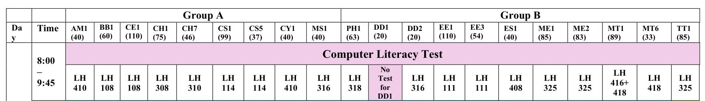
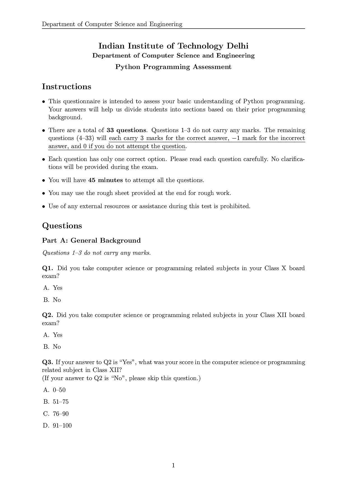
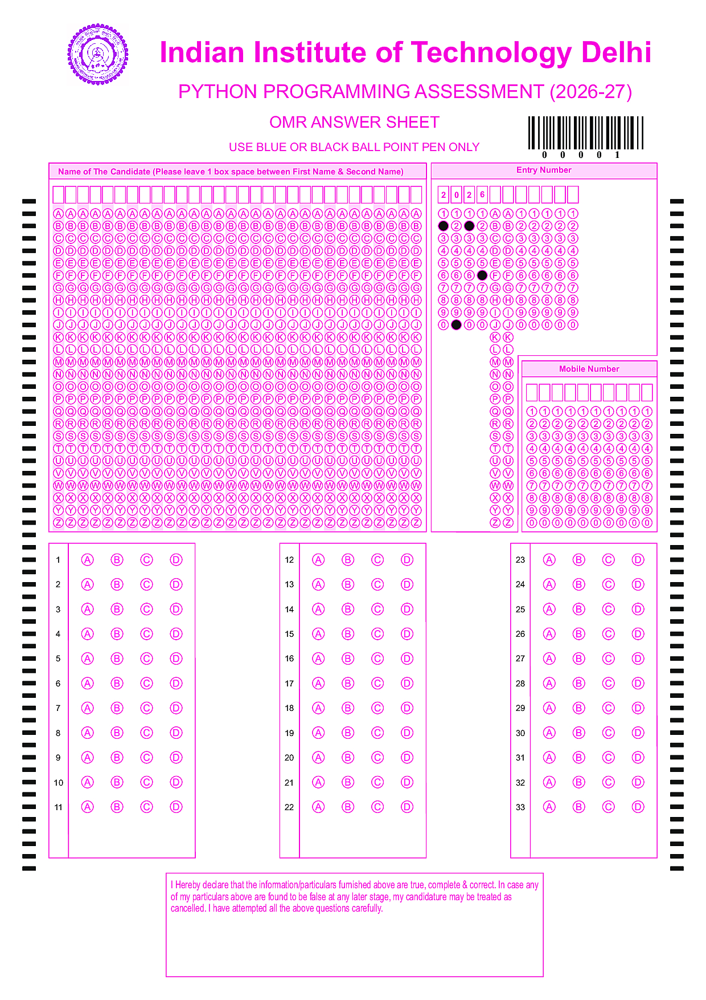

# Python Programming Assessment Test

{: .note }
>
> **📅 Wednesday, 22 July 2026**  
> **🕗 Reporting Time:** 8:10 AM  
> **📝 Exam Time:** 8:30 AM – 9:15 AM (45 minutes)  
> **🏫 Location:** See screenshot below  

{: .important }
> Please read the following instructions carefully before appearing for the assessment.

## Instructions

1. **Attempt the assessment honestly.** Please avoid random guessing. The purpose of this assessment is to evaluate your current background knowledge of the **Python programming language** so that you can be assigned to an appropriate batch.
>
> **Important:** This assessment **does not affect** the syllabus, course content, or learning outcomes. All batches will cover the same course material; the assessment is used **only for batch allocation**.

You will have the option to count these marks in place of the first COL1000 quiz (scheduled in the 4th week of the semester).
2. **What to bring to the exam?** 
	- Please bring a blue/black ballpoint pen to fill the OMR sheet. 
	- You will also need to carry a physical ID (e.g., Aadhaar card).
	- You are NOT allowed to bring any electronic device (including electronic watches and mobiles).

3. **Enter your Entry Number carefully.** You will be asked to enter your **Entry Number** on the answer sheet. Please ensure that it is entered correctly and remember it throughout the assessment.

4. **Please familiarize yourself with the front page of the examination and OMR sheet before you begin.** A snapshot of the front page and the OMR sheet is provided below.

---

## Snapshot of the Front Page of Exam

## Snapshot of the OMR sheet

